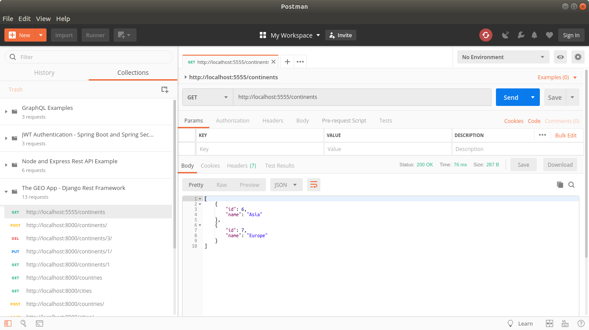
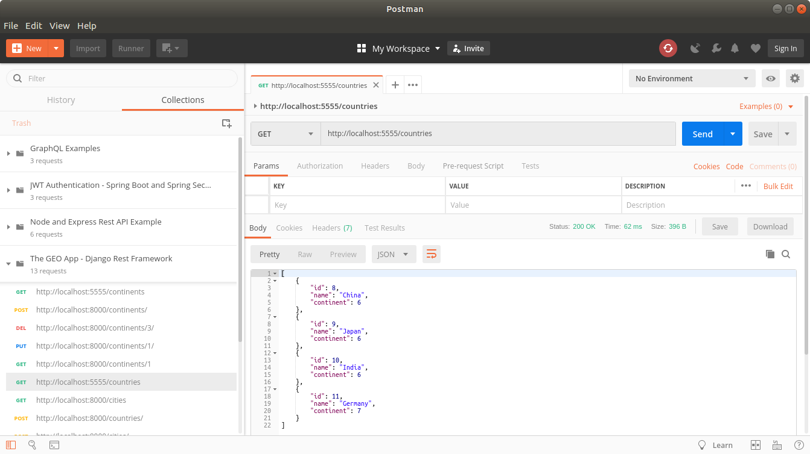
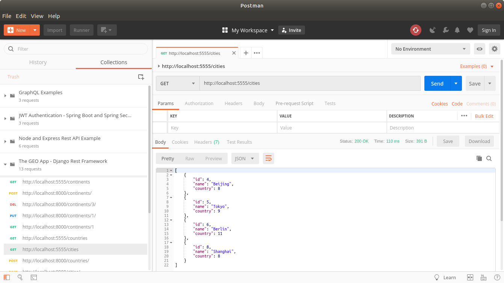

THE GEO REST API (DJANGO REST FRAMEWORK)
---------------------------------------------------------------------------------------------------

Rest API developed with Django Rest Framework and MongoDB.

This app contains 3 services that manipulate info about continents, countries and cities.

---------------------------------------------------------------------------------------------------

**Get call to continents endpoint from Postman:**

---------------------------------------------------------------------------------------------------

**Get call to countries endpoint from Postman:**

---------------------------------------------------------------------------------------------------

**Get call to cities endpoint from Postman:**

---------------------------------------------------------------------------------------------------
