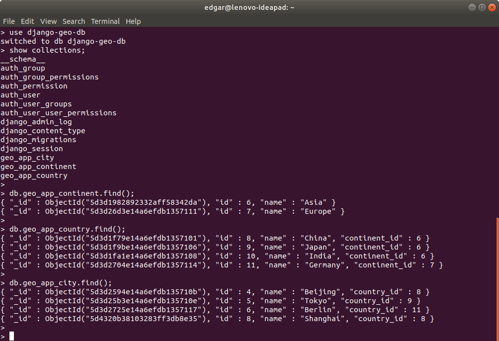

THE GEO REST API (DJANGO REST FRAMEWORK)
-------------------------------------------------------------------------------------------------------

Ejemplo de API REST desarrollada con Django Rest Framework, Djongo y MongoDB.

La aplicación contiene los servicios rest necesarios para manipular información de continentes, 
paises y ciudades que son utilizados por la aplicación SPA "Geo App Client", desarrollada con Vue.

https://brightdog@bitbucket.org/brightdog/vue_geo_app_client

-------------------------------------------------------------------------------------------------------

**Datos almacenados en MongoDB**

-------------------------------------------------------------------------------------------------------

**Llamada a servicio de continentes desde Postman**

-------------------------------------------------------------------------------------------------------

**Llamada a servicio de paises desde Postman**

-------------------------------------------------------------------------------------------------------

**Llamada a servicio de ciudades desde Postman**

-------------------------------------------------------------------------------------------------------